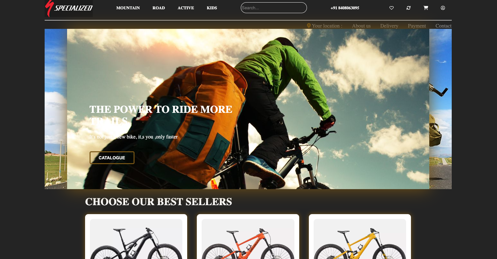
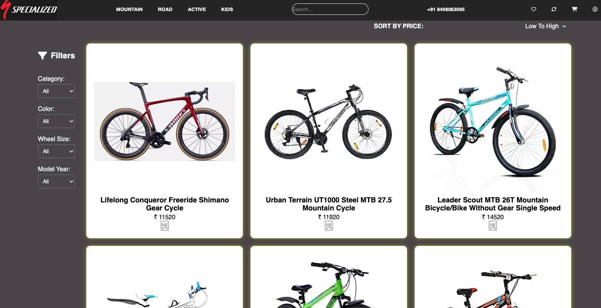
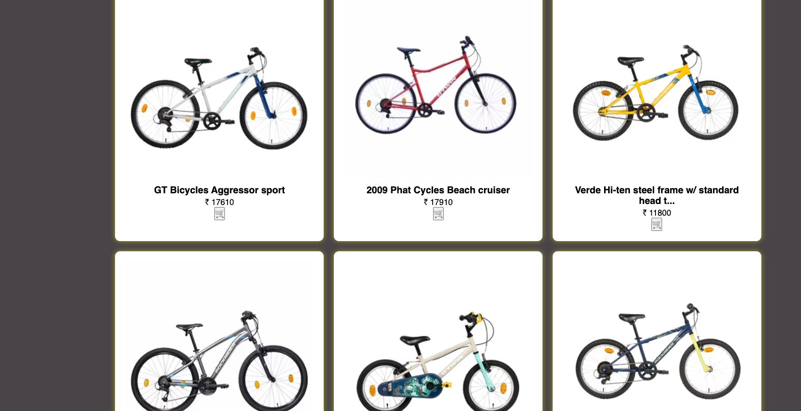
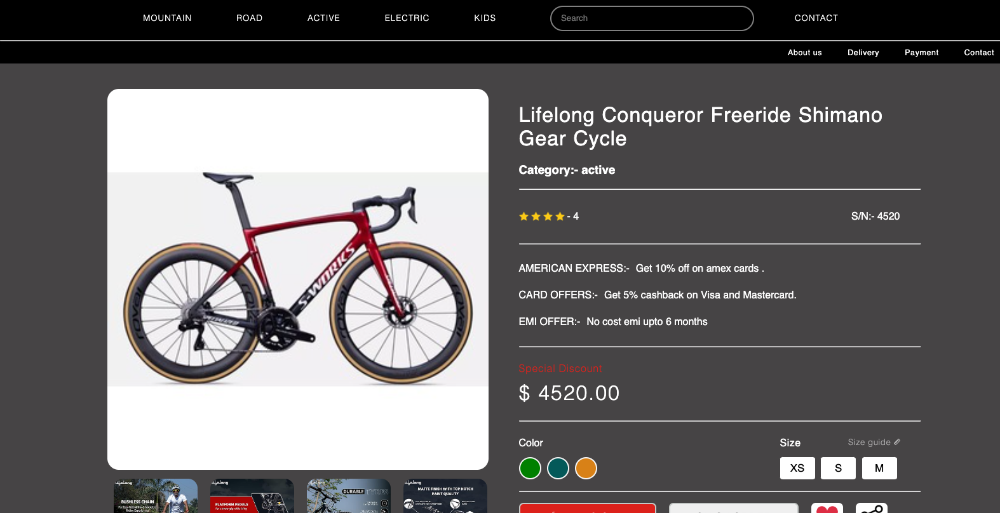
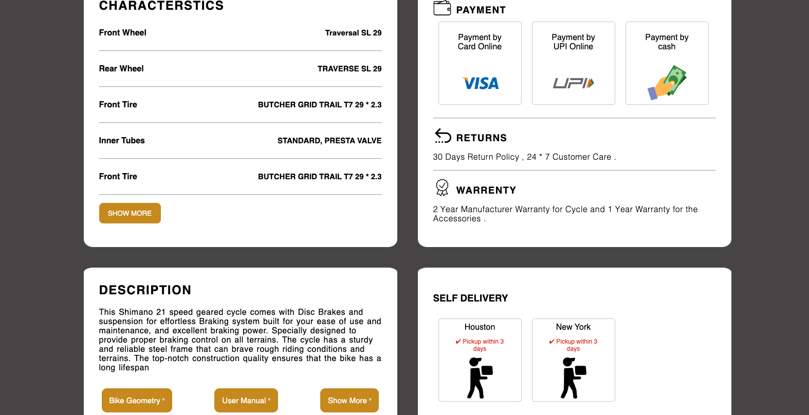

# busy-industry-7181
This is unit 5 final project. we are devolping cycle webiste https://busy-industry-7181.netlify.app .
# Specialized

#  Welcome Here!

Hello Readers, 
It was during the final week which is depicted as the construct week. We have done this project with group of 4 members and build cycle wesbite .This Project is our construct week project in Unit-5 an we give a name to our project 

  I hope you will enjoy the reading….

 

#  Tech Stack Used: 

We have used Html5, CSS, Advance JavaScript,Local Storage for building this Project. We also used tools like GitHub for collaboration of our project, Slack & Zoom as means of a communication channel.

#  Details of Tech stack used: 

<b>HTML5:</b>

we have used to build the basic structure of the website. All headings, Paragraphs, links, forms, etc. were structured by HTML.

 <b>CSS:</b>

We have used to add styling to the website. We used Advance CSS for Popup Modal window for login/Sign up, Payment, and all other styling.

 <b> Advance JavaScript:</b>

We have used to add logical functionalities to the web pages like the on Click function. We have added all the functionalities.

<b> Local storage:</b>

We have used local-storage as a database for storing users’ data, products details, and cart details.

Let us share our experience, 
This entire journey of making the project was awesome. We have learned lots of things by applying to the real website and it gave us a lot of confidence. there were some more functionalities that could have been done, yeah the time didn’t permit us to go further. But we will surely improve it during the course of time in future .

## So jurney started from here!

### Snapshots of our project :- 

- ##  Home Page 

- ##  Product Pages

- ##  Product Details Page

 
  

 

 
 
 

  

# Our Journey: 
As we are all new and never work on a project so our first day gone in discussion about how we start and who did which work, In evening finally we decide distribute our work.
On the second day we start with our morning scrum and decide the deadline to complete the whole project and start working on it, the In evening stand-up we discussed our challenges and problem and try to resolve them.
2 days we have the same routine and finally on the fourth day our given task is ready but when we merge the all parts the main problem came like many classes and ids are same due to that the structure of all products was very bad but our Team take it as a challenge and change and put comments on code in just one and half day.
on the seventh day again we merge all our code and finally, we did it, There were some changes that need to be done and we all did it and finally, we record our presentation and Submit.
 

# Conclusion: 
We are very thankful for the support of my teammates and instructor for the completion of project in due time. We will looks forward to add some feature and functionality which we left in this project for future expensions.

#  Thank Your For Reading 

